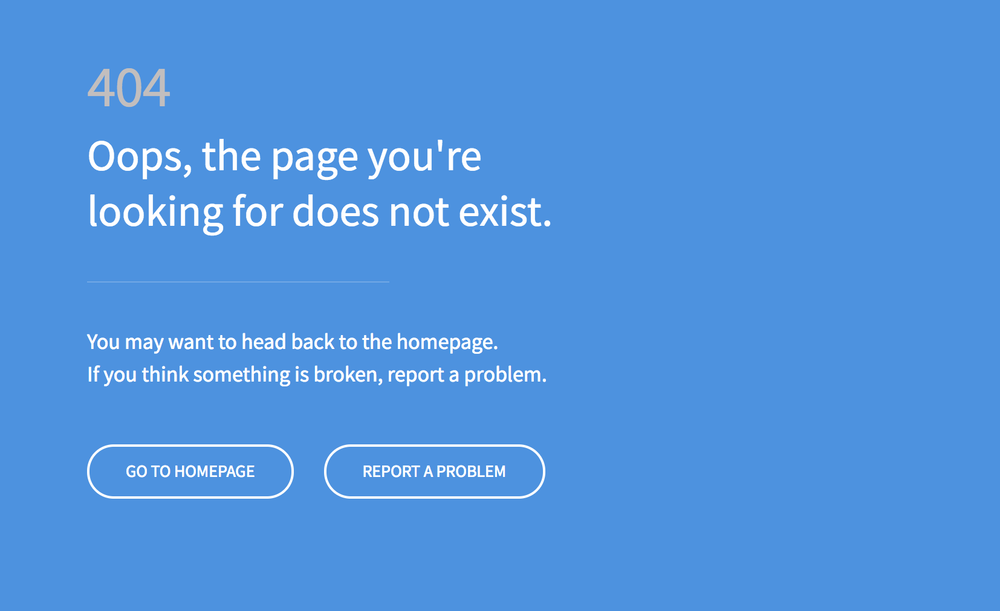

<!-- This file was automatically generated by the `build-harness`. Make all changes to `README.yaml` and run `make readme` to rebuild this file. -->

# default-backend 

This is a default-backend server powered by Nginx. It's purpuse is to serve as a default backend for an ALB default target group with the [`terraform-aws-alb`](https://github.com/cloudposse/terraform-aws-alb) module	, much the way a [`nginx-default-backend`](https://github.com/cloudposse/charts/blob/master/incubator/nginx-default-backend/) is used with ingress controllers for kubernetes.

The default backend is an HTTP service that handles all URL paths and hosts that the ALB does not understand (i.e., all the requests that are not mapped with an Ingress).

Basically, a default backend responds to two URLs:

- `/` that returns 200
- `/foobar` that returns 404

---

## Screenshots



*Example of the default 404 status page returned by backend*
vim 

## Usage

```
docker run -p 1234:80 hansohn/default-backend:latest
```
